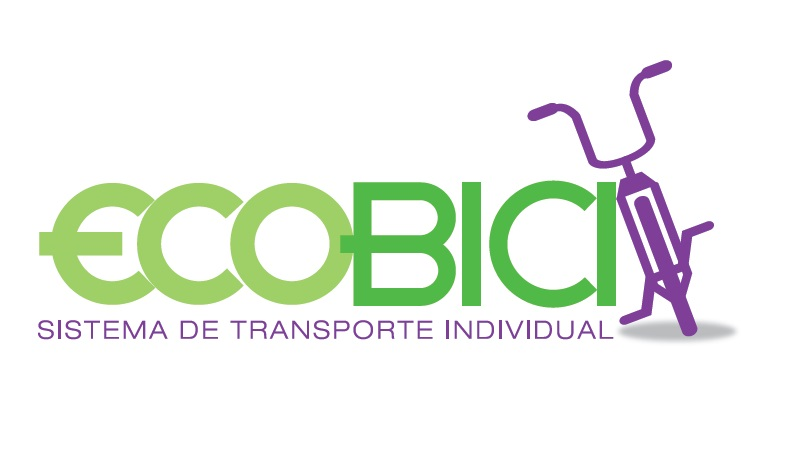

```{r setup, include=FALSE}
knitr::opts_chunk$set(echo = TRUE)
```

&nbsp;

## SISTEMA DE TRANSPORTE INDIVIDUAL **ECOBICI**  

&nbsp;

### Propuesta final  para predecir la demanda por AGEB de las cicloestaciones de la CDMX

> Scoping

Actualmente existe en ECOBICI ya toda una experiencia del negocio en la distribución, crecimiento, servicio y análisis del sistema nacional mas grande de bicicletas publicas compartidas. Este sistema permite a los ciudadanos registrados tomar una bicicleta de cualquier cicloestación y devolverla en la más cercana a su destino en trayectos ilimitados de 45 minutos. Quienes quieran acceder al Sistema ECOBICI, podrán pagar una suscripción por un año, una semana, tres días o un día.

El sistema de bicicletas publicas compartidas es hoy en dia una de las mejores alternativas de movimiento para los capitalinos de la Ciudad de México, ademas de ser un transporte ecologico y sustentable promueve el ejercitamiento fisico de la población de forma masiva. Tambien tiene como beneficios la mejora en la calidad de vida y ahorros significativos en el gasto de transporte de la poblacion y uso del tiempo de un individuo.

Aunque actualmente ya existen soluciones a las diferentes respuestas del flujo o proceso de ECOBICI desde el registro de los usuarios, el uso de las bicis y algunas problematicas que se desprenden por el uso natural de una bicicleta, no existen las respuestas optimas a los diferentes retos que dia a dia presenta el prestador del servicio y los usuarios.

 

Preguntas y "soluciones" como la anterior provocan que el objetivo del programa se desvirtue, que los usuarios tengan afectaciones de tiempo y distancia (al haber usuarios que usen las bicis para distancias cortas), que el usuario se pueda ver afectado al encontrar la siguiente estacion llena, y todas las consecuencias que podamos imaginar.

&nbsp;

> Metas del programa

Se ha desarrollado una propuesta integral innovadora para la principal problemática encontrada, además que se han tratado de cubrir diferentes aspectos del negocio para mejorar exitosamente el programa.


* El desarrollo se deberia de enfocar en los siguientes 3 puntos fundamentales del negocio:

    1. Desarrollo de integraciones eficientes al negocio. 
    
          + Contempla la inteligencia del negocio en generar lazos solidos con compañias de seguros, proveedores,              soporte al interior de la organizacion, y soporte externo dirigido a las estaciones, modulos de orientacion y                 bicis directamente.
          
  
    2. Desarrollo de area de innovacion.
    
          + Uno de los pilares mas fuertes propuestos, el cual debera contemplar abrir la brecha a nuevas ideas, oportunidades de negocio, mejoras de procesos y definición de alcances.
          
  
    3. Desarollo de data product & analytics
    
          + Es la solución mas exacta y directa al problema planteado, por la naturaleza y contexto es un problema complejo que debera de tener una solución simple, reproducible y cuantificable.


&nbsp;

> Acciones 

Las acciones a tomar derivadas de los 3 puntos a seguir para la mejora del sistema de ECOBICI seran estructuradas de la siguiente manera.

Las `areas de gestion interna` o los `los administradores de riesgo` realizaran un concurso de proyectos relacionados con compañias de seguros, proveedores, y diversas figuras del entorno del sistema. Los concursos deberan cubrir lo siguiente:

* Para la parte de seguros se debera de buscar un `proveedor externo` con el respaldo de una `aseguradora` que genere una aplicacion movil para los usuarios e informe sobre la demanda en tiempo de real de cada estación, asi como las rutas trazadas de forma georeferenciada, informacion de su cuenta, estadisticas de uso, una seccion `fitness` para ver el consumo calórico, y lo mas importante el costo por viaje y las coberturas del seguro. 

 

* Para la parte de soporte al interior de la organización como `científico de datos` se buscara brindar un marco general sobre uso y explotación de datos asi como el manejo de programas y proyectos, lo cual conlleva al desarrollo e implementación de los mismo. Este soporte sera generado asi mismo para la "toma de decisiones" de los directivos de la empresa, asi mismo sera soporte de los aspectos relevantes para el funcionamiento de los `modulos de apoyo`, estaciones y `provedores de logistica` (camionsitos acomodadores de bicis). La integracion hacia el exterior incluye `proveedores de servicios` de mantenimiento de bicis, estaciones y corredores viales o ciclopistas. Para ello se buscara que los proveedores sean pertenecientes a una cultura de retos y cambios.

* Para la parte de innovación se debera de generar un equipo multidiciplinario con `recursos propios` del sistema ECOBICI, que motiven a participar en sesiones de "focus groups" contribuyendo a la generación y desarrollo de ideas.
Por ejemplo, en las estaciones de servicio podran ser instalados `dispositivos electronicos` de recarga de tarjetas electronicas de la red del sistema de transporte colectivo, terminales para el retiro de efectivo de alguna tarjeta bancaria, maquinas de pago de estacionamiento "parking", asi como centros de recarga telefonica entre otros. Esta parte de inovacion es muy importante ya que la adaptabilidad de estos sistemas depende de una constante retroalimentacion del entorno, generacion de ideas e implementacion de las mismas. 

  

* La generacion de un `Data Product` estara a cargo directamente del `Científico de Datos` el cual incluira los siguientes puntos: 

    + Análisis y diseño de un DWH
    + Generación de templates
    + Implementación de Icloud de bajo costo
    + Implementación de cloud-processing
    + Desarrollo de ingesta y pipeline de datos
    + Implementación de un orquestador
    + Desarollo de algoritmos de ML con evolución a DeepLearning
          + Para este punto es necesario elaborar un pequeño flujo de analisis, seleccion de variables, entrenamiento, calibracion, reduccion y transformacion de variables, seleccion de punto de corte optimo, evaluacion de algoritmos y medicion del error. Este flujo estara a cargo de generar los `scores` necesarios del modelo para evitar saturacion de bicis en las diferentes estaciones. La escalabilidad de DeepLearning podria ser tomada en segundo plano por la dificultad en la interpretabilidad de los resultados. Se busca primero generar confianza y liderazgo en la organizacion, para asi después aventurarse a implementaciones mas complejas. 
    + Y finalmente la implementación de dashboard interno y visualizaciones generales del sistema y su funcionamiento, que sean capaces de tener una retroalimentación automatica.
    En caso de contar con mas información se podrian evaluar los ERP's existentes asi como algunas validaciones de sistemas, ajustes o recalibraciones de reglas del negocio, asi como una integracion mas detallada de RDBS.
    

**Nota. Esta parte de acciones podria ser detallada aun mas en un caso real, con estadisticas reales, un ROI bien elaborado, algunas graficas de tiempos y costos, por efectos escolares se generalizo bastante**

> Fuentes de Datos

Las fuentes que necesitamos son todas aquellas recolecciones que se comentaron en el punto anterior. Pero para ello se debera generar lo siguiente:

`Un data lake estructurado` que contemple la ingesta de los diversos datos. Los datos segun el origen mencionado podran ser:

* Datos generados por la App Movil
* Metadata de registro de usuarios
* Información bancaria
* Información y registro de ubicaciones o paradas (GPS)
* Datos generada por los camionsitos de soporte
* Datos generados por los proveedores de mantenimiento de bicis, sobre el uso, desgaste, sustitución de equipo
* Datos generados por los dispositivos electronicos de las estaciones
* Datos generados por los modulos de atención y servicio
* Informacion vial del GDF
* Información de emisión y siniestros por parte de la cia. de seguros

Actualemte las estadisticas se limitan a recopilar, procesar y mostrar informacion sobre usos y registro de usuarios, lo cual permite de forma muy limitada tener unicamente visualizaciones como se muestra enseguida.

 

Dado lo anterior, suponiendo que se cuente con un `data lake` agil y de facil acceso, se podria generar la parte de inteligencia de negocios, analitica y busqueda de nueva información. Asi mismo esto podria generar analisis mas eficientes que puedan mostrar una vision mas amplia del alcance del sistema, el cual pasara de ser algo no observado por la poblacion, a ser algo que contribuya de manera muy exitosa en la comunidad. 

> Modelos

El modelo consiste en generar una gran fuente de información, pipelines sencillos y agiles, asi como generar solidez en los datos, accecibilidad y confianza; asi mismo se contempla el uso  de algoritmos de ML y sus resultados "scores" como solucion directa al problema inicial, dada la madurez del sistema, es necesario consolidar de forma mas robusta a toda la organización, preparandola para enfrentar el crecimiento exponencial de usuarios y por ende de viajes. 

* El modelo podria definirse como sigue:

      + Generar e implementar Data Lake (incluye todos sus componentes y fuentes de datos vistas anteriormente)
      + Desarollar e implementar pipelines directos al negocio, y algunos alternos de data analitics
      + Hacer el entrenamiento y seleccion del mayor numero posble de `algoritmos`, por ejemplo `scores` de demanda por estacion por hora por dia de la semana (problema estacional), entre otros.
      + Diseño de BI para directivos, con `KPIs` sencillos y en realtime
      + Diseño e implementación de `DashBoards` para keyusers
      + Generación de `metricas` por viaje, por individuo, por estacion, por proveedor, por area, por centro de costos, de desempeño, de productividad, de rentabilidad, de gastos, de tasas de ayuda, satisfacción y beneficio al consumidor.
      + Asi mismo integrar al `pipeline` la capacidad de retrolimentación y ajuste de parametros de forma en que la intervención humana sea lo menos posble. 

> Data Maturity

La madurez de los datos se encuentra en un termino `BASICO` dado que el sistema aun no puede generar información de forma automatica, asi mismo dependen aun de las BD de forma directa, pudiendo afectar a estas de forma grave. Asi mismo no se tiene una idea clara sobre la forma en que se pueden usar los datos y para que decisiones puede haber un respaldo a traves de ellos. Asi mismo la organizacion no es capaz de justificar el por que de la ingesta actual de los datos, es decir, no saben si tienen poca o mucha información. 

Tambien no existe el uso de pipelines complejos de analisis en tiempo real, el uso de algoritmos predictivos y sobre todo la integración y adaptabilidad al entorno. Asi pues evaluando y promediando los resultados del cuestionario, se ha determinado su estado actual, esto sin dejar aun lado el objetivo de llegar a ser lider en el tema.

&nbsp;

  by Ricardo Lastra


